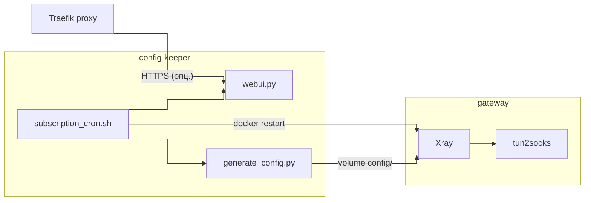

# docker-xray-tun2socks-gateway

Стек Docker Compose: **Xray** (VLESS/Reality) и **tun2socks** в одном контейнере, отдельный сервис **config-keeper** — рендер `config/` из подписки или `FULL_STRING`, периодическое обновление, **WebUI** для смены профиля, опционально выход наружу через **Traefik**.

## Возможности

- Подписка (`SUBSCRIPTION_URL` + `SUBSCRIPTION_INDEX`) или `FULL_STRING` / legacy-поля — см. `scripts/generate_config.py`
- Автогенерация `config/config.json` и `config/tun_excluded_routes.env` (исключения маршрута до VPN-сервера и LAN)
- При неверном индексе подписки используется первый профиль (с предупреждением в логах)
- WebUI выбора профиля и URL подписки; при сохранении — обновление `.env`, перегенерация конфига и `docker restart` gateway
- Маршруты и `iptables` при смене профиля: `tun2socks_netns_bootstrap.sh` сбрасывает старые `ip rule` / mangle перед применением новых (важно при `docker restart`)
- Traefik: хост и TLS-домены задаются через `.env`, ограничение доступа `ipAllowList`

## Архитектура



## Требования

- Docker с Compose
- Внешняя сеть **macvlan** (имя из `VPN_LAN_DOCKER_NETWORK` в `.env`) — статический IP gateway в вашей LAN
- Для WebUI через Traefik: внешняя сеть **`proxy`** (как в типичной установке Traefik) и DNS на ваш домен

## Быстрый старт

1. Скопируйте `.env.example` в `.env` и заполните под свою сеть, подписку, Traefik.
2. Соберите образ gateway и поднимите стек:

   ```bash
   docker compose build --pull gateway
   docker compose up -d
   ```

3. Первый рендер конфига выполнит `config-keeper` после старта; при необходимости проверьте логи: `docker logs xray-gateway-config-keeper`.

Проверка разбора подписки без записи файлов (контейнер уже запущен):

```bash
docker exec xray-gateway-config-keeper python3 scripts/generate_config.py --show-parse
```

Либо с хоста, из корня проекта (нужен Python 3):

```bash
python3 scripts/generate_config.py --show-parse
```

## Файлы конфигурации

| Файл | Описание |
|------|----------|
| `.env` | Секреты и вся среда |
| `config/config.json` | Генерируется |
| `config/tun_excluded_routes.env` | Генерируется |
| `config/config.json.example` | Пример структуры |

## Traefik

Метки читают из `.env` переменные `TRAEFIK_*`, `PUBLIC_HOST`, `TLS_DOMAIN_*`, `TRAEFIK_IP_ALLOWLIST`, `WEBUI_PORT`. Убедитесь, что DNS указывает на точку входа Traefik и resolver (например Cloudflare DNS challenge) настроен у вас в Traefik.

## Обновление бинарей в образе gateway

```bash
docker compose build --pull gateway
docker compose up -d
```

## Безопасность

- Ограничьте доступ к WebUI списком сетей/адресов в `TRAEFIK_IP_ALLOWLIST`.

## Лицензии сторонних образов

Сборка использует официальные/публичные образы [Xray-core](https://github.com/XTLS/Xray-core) и [tun2socks](https://github.com/xjasonlyu/tun2socks); ознакомьтесь с их лицензиями отдельно.
